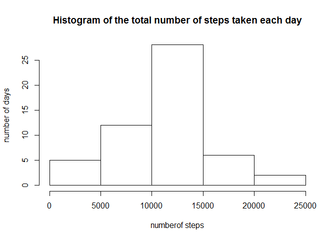
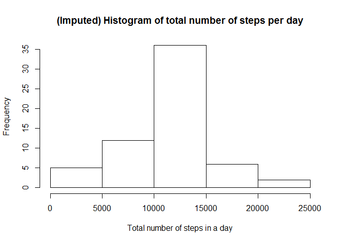

# Reproducible Research: Peer Assessment 1


## Loading and preprocessing the data

```r
unzip(zipfile = "activity.zip")
readDataset <- read.csv("activity.csv")
```

## Process/transform the data (if necessary) into a format suitable for your analysis

```r
datacomplete <- readDataset[!rowSums(is.na(readDataset)), ]
```

## What is mean total number of steps taken per day?
1. Let us calculate the number of steps taken per day

```r
daysteps <- aggregate(steps~date, datacomplete, FUN = sum)
```
2. Make a histogram of the total number of steps taken each day

```r
hist(daysteps$steps,main = "Histogram of the total number of steps taken each day",xlab = "numberof steps", ylab = "number of days")
```

<!-- -->
3. Calculate and report the mean and median of the total number of steps taken per day

```r
meandaysteps <- mean(daysteps$steps)
meandaysteps
```

```
## [1] 10766.19
```

```r
mediandaysteps <- median(daysteps$steps)
mediandaysteps
```

```
## [1] 10765
```
The mean of the total number of steps taken per day is 1.0766189\times 10^{4}   
The median of the total number of steps taken per day is 10765 
## What is the average daily activity pattern?
1. Make a time series plot (i.e. type = "l") of the 5-minute interval (x-axis) and the average number of steps taken, averaged across all days (y-axis)

```r
stepsInterval<-aggregate(steps~interval,datacomplete,mean)
plot(steps~interval,data=stepsInterval,type="l")
```

<!-- -->

2. The 5-minute interval that, on average, contains the maximum number of steps

```r
stepsInterval[which.max(stepsInterval$steps),]$interval
```

```
## [1] 835
```
The 5-minute interval that, on average, contains the maximum number of steps is 835

## Imputing missing values
1. Calculate and report the total number of missing values in  
the dataset (i.e. the total number of rows with NAs)  

```r
navaluedata <- readDataset[rowSums(is.na(readDataset)), ]
# nrow(navaluedata)
```
the total number of rows with NAs is 2304  
2. Devise a strategy for filling in all of the missing values  
in the dataset. The strategy does not need to be sophisti-  
cated. For example, you could use the mean/median for that   
day, or the mean for that 5-minute interval, etc.  

I will fill the NA with average value for that 5-min interval  

3. Create a new dataset that is equal to the original dataset but
with the missing data filled in.

```r
imputed <- readDataset

for (i in 1:nrow(imputed)){
    if (is.na(imputed$steps[i])){
        imputed$steps[i] <-  
          stepsInterval[which.max(stepsInterval$steps),]$steps}
}
# imputed <- arrange(imputed, interval)
head(imputed)
```

```
##      steps       date interval
## 1 206.1698 2012-10-01        0
## 2 206.1698 2012-10-01        5
## 3 206.1698 2012-10-01       10
## 4 206.1698 2012-10-01       15
## 5 206.1698 2012-10-01       20
## 6 206.1698 2012-10-01       25
```
4. Make a histogram of the total number of steps taken each day  
and Calculate and report the mean and median total number of   
steps taken per day. Do these values differ from the estimates  
from the first part of the assignment? What is the impact of  
imputing missing data on the estimates of the total daily number  
of steps?

```r
# perform the imputation
for (i in 1:nrow(readDataset)){
  if (is.na(readDataset$steps[i])){
    interval_val <- readDataset$interval[i]
    row_id <- which(stepsInterval$interval == interval_val)
    steps_val <- stepsInterval$steps[row_id]
    readDataset$steps[i] <- steps_val
  }
}

# aggregate steps as per date to get total number of steps in a day
table_date_steps_imputed <- aggregate(steps ~ date, readDataset, sum)

# create histogram of total number of steps in a day
hist(table_date_steps_imputed$steps, main="(Imputed) Histogram of total number of steps per day", xlab="Total number of steps in a day")
```

<!-- -->

```r
# get mean and median of total number of steps per day
mean(table_date_steps_imputed$steps)
```

```
## [1] 10766.19
```

```r
median(table_date_steps_imputed$steps)
```

```
## [1] 10766.19
```

```r
# get mean and median of total number of steps per day for data with NA's removed
mean(daysteps$steps)
```

```
## [1] 10766.19
```

```r
median(daysteps$steps)
```

```
## [1] 10765
```

## Are there differences in activity patterns between weekdays and weekends?
1. Create a new factor variable in the dataset with two levels - "weekday"   
and "weekend" indicating whether a given date is a weekday or weekend day.

```r
# convert date from string to Date class
readDataset$date <- as.Date(readDataset$date, "%Y-%m-%d")

# add a new column indicating day of the week 
readDataset$day <- weekdays(readDataset$date)
table(readDataset$day)
```

```
## 
##    Friday    Monday  Saturday    Sunday  Thursday   Tuesday Wednesday 
##      2592      2592      2304      2304      2592      2592      2592
```

```r
# add a new column called day type and initialize to weekday
readDataset$day_type <- c("weekday")
str(readDataset$day_type)
```

```
##  chr [1:17568] "weekday" "weekday" "weekday" "weekday" ...
```

```r
unique(readDataset$day_type)
```

```
## [1] "weekday"
```

```r
# If day is Saturday or Sunday, make day_type as weekend
for (i in 1:nrow(readDataset)){
  if (readDataset$day[i] == "Saturday" || readDataset$day[i] == "Sunday"){
    readDataset$day_type[i] <- "weekend"
  }
}
# convert day_time from character to factor
readDataset$day_type <- as.factor(readDataset$day_type)
# aggregate steps as interval to get average number of steps in an interval across all days
table_interval_steps_imputed <- aggregate(steps ~ interval+day_type, readDataset, mean)
# make the panel plot for weekdays and weekends
library(ggplot2)
qplot(interval, steps, data=table_interval_steps_imputed, geom=c("line"), xlab="Interval", 
      ylab="Number of steps", main="") + facet_wrap(~ day_type, ncol=1)
```

<!-- -->
